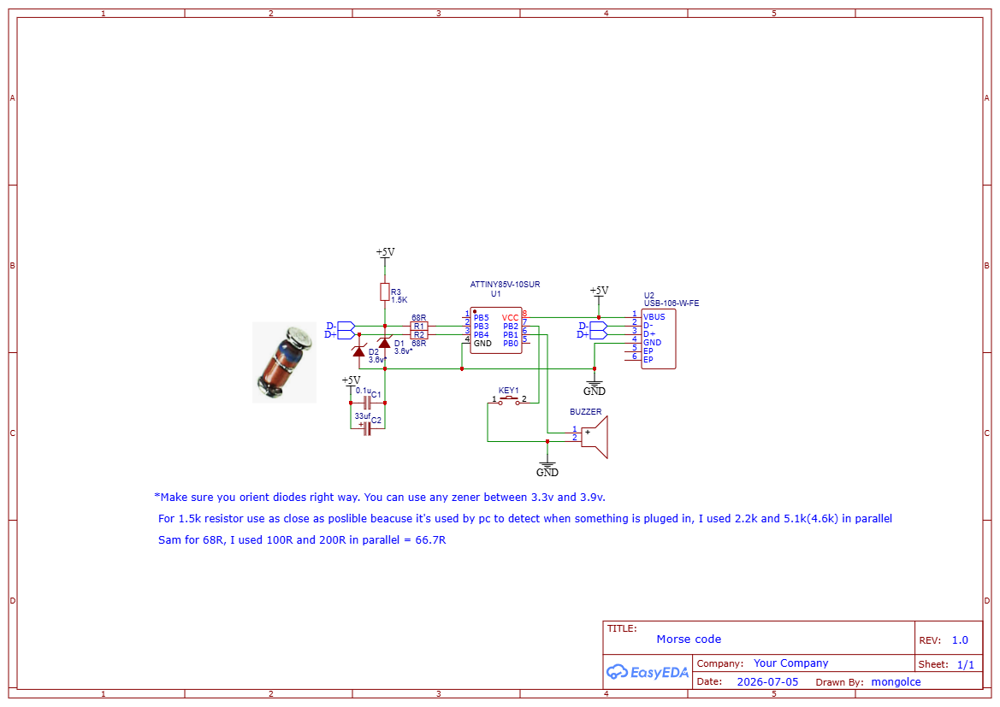

# Morse-Code-Keyboard
## Hardware
Build this circuit on a piece of perf board or make your own pcb

## Loading Code
#### Burning bootloader
To load a code on attiny85, first you need to burn micronucleus bootloader.
Add this to prefrences and in Boards Manager install ATTinyCore by Spence Konde:
```http
https://raw.githubusercontent.com/SpenceKonde/ReleaseScripts/refs/heads/master/package_drazzy.com_index.json
```
Now select ATtiny85(Micronucleus/DigiSPark) board and change Burn Bootloader Methode to Fresh Install(via ISP) and select your programmer you can use arduino nano/uno for that and click burn bootloader.
#### Installing Digistump
Because now you have a micronucleus bootloader you can put attiny on your usb board. To use digistump libraries you need to instal DigiStump board for that add this in prefrences and install it in board manager:
```http
https://raw.githubusercontent.com/digistump/arduino-boards-index/master/package_digistump_index.json
```
Now select Digispark(default - 16.5mhz) board, also chose micronucleus as bootloader and click upload. Don't plug in your usb board before you see you need to do that in output.
## App
I also built this windows app that's uselles for learning morse code but it looks nice. I saw something like this on instagram so I wanted to build it.
