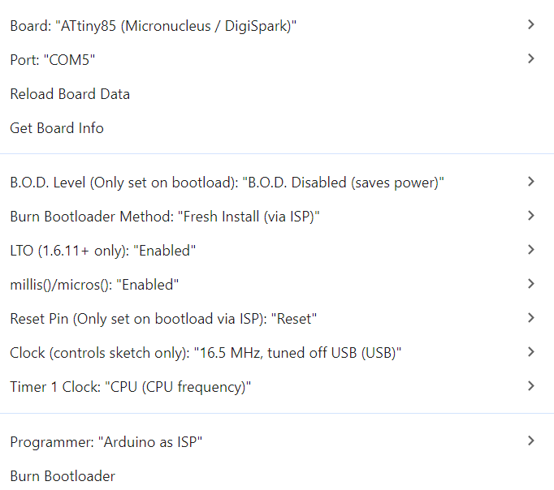
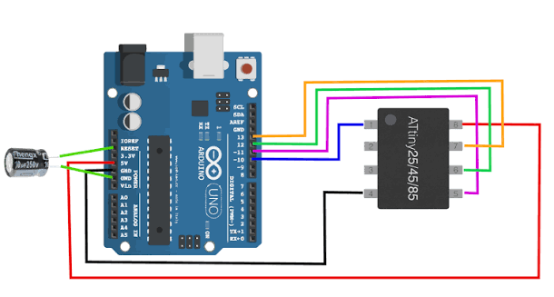
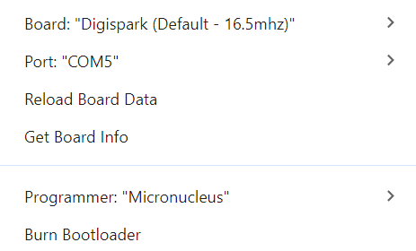
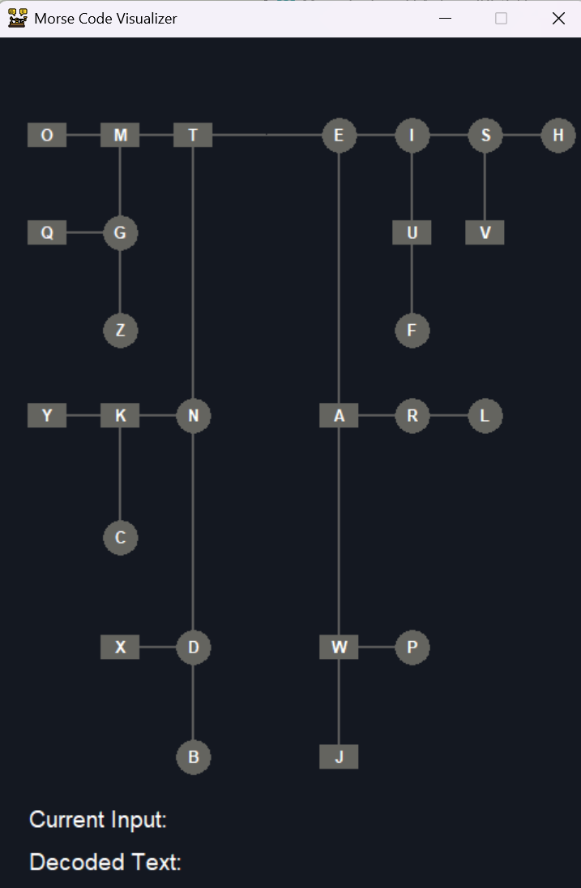

# Morse-Code-Keyboard
## Hardware
Build this circuit on a piece of perf board or make your own PCB. Make sure to use specified values of components.

## Loading Code
#### Installing drivers for programming
To program attiny with micronucleus you will first need to download Digistump.Drivers.zip from link:

https://github.com/digistump/digistumparduino/releases

After downloading un-zip it and run DPinst64.exe.
#### Burning bootloader
To load a code on attiny85, first you need to burn micronucleus bootloader, add this to prefrences and in Boards Manager install ATTinyCore by Spence Konde:
```http
https://raw.githubusercontent.com/SpenceKonde/ReleaseScripts/refs/heads/master/package_drazzy.com_index.json
```
Now select ATtiny85(Micronucleus/DigiSPark) board and change Burn Bootloader Methode to Fresh Install(via ISP).


Also you need to select your programmer. You can use whichever you want but I used arduino as isp. If you want to go that way connect you arduino with attiny like on circuit below. Before adding 10uf cap upload Arduino as ISP sketch on your programmer arduino. You can find this sketch in examples.

#### Installing Digistump
Because we installed micronucleus bootloader, you can put attiny on your perf board with USB and program it easily without ISP. To use digistump libraries you need to instal DigiStump board. First add this in prefrences and install it in board manager:
```http
https://raw.githubusercontent.com/digistump/arduino-boards-index/master/package_digistump_index.json
```
Now select Digispark(default - 16.5mhz) board, chose micronucleus as bootloader and than click upload. Don't plug it in yet, wait until you see message in output to connect your USB.

## App
I also built this windows app, although it's uselles for learning morse code, it's really fun to play with it.
[](https://github.com/mogloce622/Morse-Code-Keyboard/raw/main/Morse%20Code.zip)

